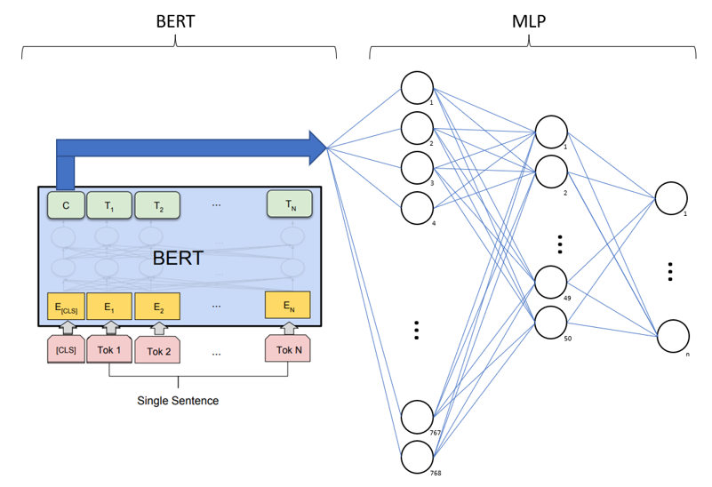
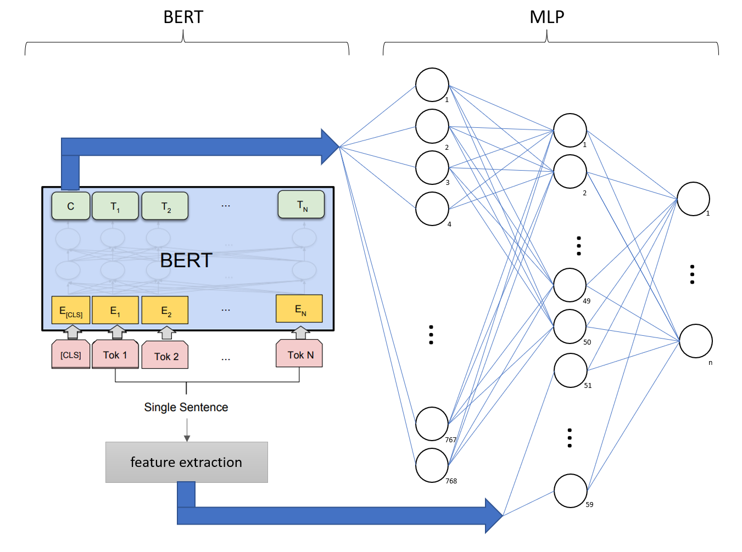
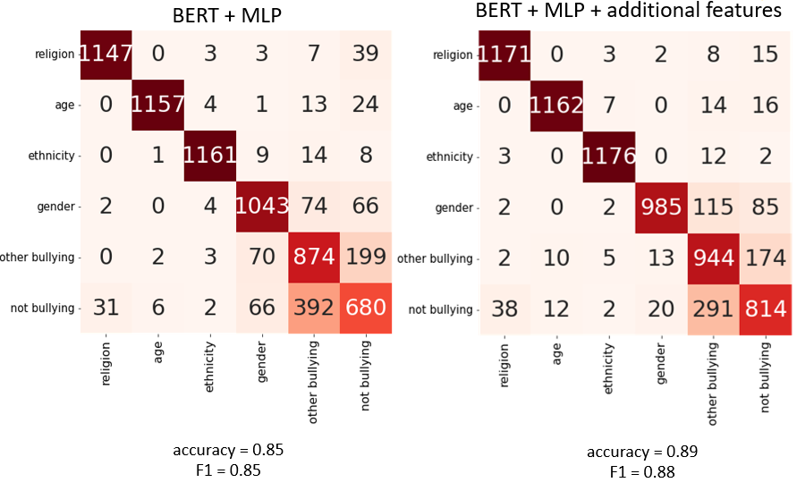
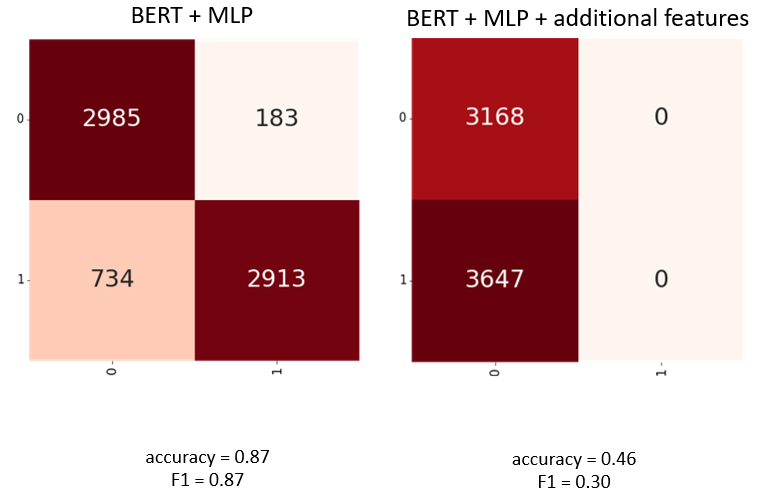
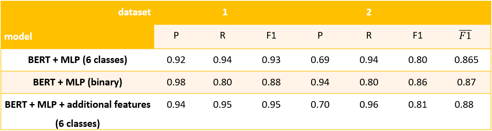

# Master's degree thesis - **Detection of Cyberbullying on Social Media**

This repository contains the code for model training used in the creation of my master's thesis. 

The data the model predicts and learns on consists of users' tweets. The tweets are divided into 6 classes - not bullying, and bullying, which is further classified into types:
- age
- ethnicity
- religion
- gender
- other cyberbullying

The models created:
1. BERT model + MLP
2. BERT model + MLP + additional features
3. binary BERT model + MLP
4. binary BERT model + MLP + additional features

The idea behind having a binary model is to have a model that recognises bullying with a higher certainty making the division between the types of cyberbullying not as important. 

### Architecture
#### Models 1 and 3:

#### Models 2 and 4:
  
  

Where n depends on the number of classes (dataset they are trained on):
- n=6 for models 1 and 2 
- n=2 for models 3 and 4

For the binary models the dataset's original labels with 5 different bullying types were labeled as 1 and not bullying as 0. The dataset was balanced prior to the training. 

### Performance
#### Training models on 6 classes

#### Training models on 2 classes

  
As can be seen from the results, additional features help the multi-class classification problem. However, with the binary problem additional features did not help but completely confuse the model's training. 

Overall performance was tested for models 1-3 on both created datasets.

Model 3 (with additional features trained on 6 classes) displays the best performance with an average **F1=0.88 and the highest recall** for bullying which was prioritized for this use case.
